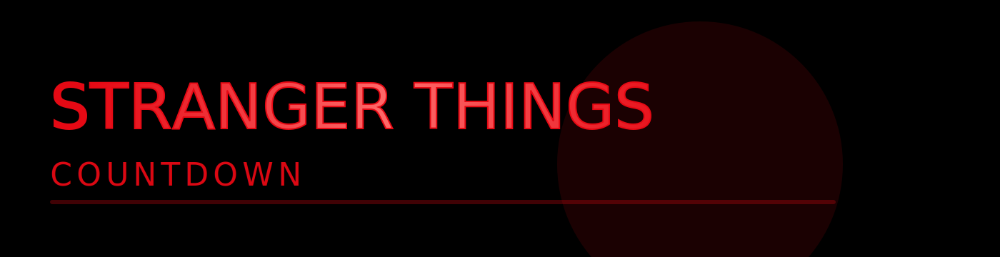
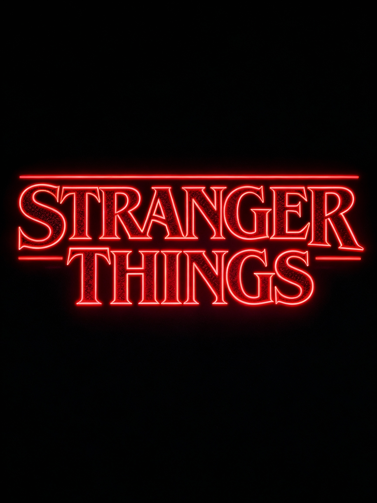

<p align="center">
  
</p>

<p align="center">
  <a href="https://011ap.github.io/stranger-things-countdown/" target="_blank">
    
  </a>
</p>

---

## Into the Upside Down

This project is a single-file, neon-styled countdown that shows days, hours, minutes and seconds until the Season 5 finale. The README includes a hero banner (above) — replace `assets/banner.svg` with your own image or video for the full effect.

**Quick highlights:**
- Live countdown timer — Days / Hours / Minutes / Seconds
- Neon, retro styling and responsive layout
- No build step — `index.html` is the whole app

Simply visit the deployed link and watch the clock tick toward destiny.

---

<p align="center">
  <a href="https://011ap.github.io/stranger-things-countdown/" target="_blank">
    
  </a>
</p>

<!-- Animated SVG fallback shown inline in README; works on GitHub and Pages -->
<p align="center">
  
</p>

---

## Project structure

```
stranger-things-countdown/
├─ index.html        # Main interface (HTML + embedded CSS + JS)
└─ README.md         # This file
```

Everything is bundled in `index.html` for simplicity and portability.

---

## Customization

- Change the target date/time: edit `releaseDate` inside `index.html` (look for a line like `const releaseDate = new Date('2025-11-27T06:30:00+05:30').getTime();`).
- Change visuals: update CSS variables near the top of the embedded `<style>` in `index.html` (colors, glow, spacing).
- Add or remove buttons, links, or text directly in `index.html` — the project is intentionally small and editable.

---

## Accessibility & improvements

Suggestions for contributors:

- Improve keyboard navigation and ARIA attributes
- Provide localization for different timezones and formats

If you want to contribute, open an issue or submit a PR.

---

## Credits

- Inspired by: Stranger Things (Netflix)
- Built with: plain HTML, CSS, and JavaScript

---

## Shareable link (what to send to everyone)

```
https://011ap.github.io/stranger-things-countdown/
```

Share that link and anyone can view the live countdown.

---
